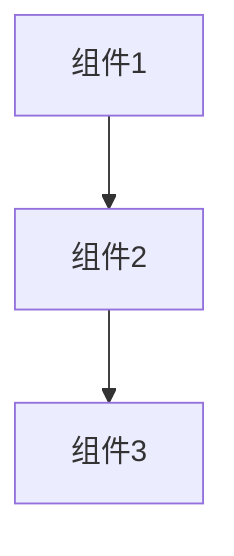

# AI 架构助手 功能逻辑文档

> 本文档详细梳理 Excalidraw 中 AI 架构助手 的完整功能逻辑、数据流和架构设计。
>
> 最后更新：2026-02-07

---

## 📋 目录

1. [功能架构概览](#功能架构概览)
2. [核心功能模块](#核心功能模块)
3. [数据流图](#数据流图)
4. [关键流程详解](#关键流程详解)
5. [Prompt 设计](#prompt-设计)
6. [优化建议](#优化建议)

---

## 功能架构概览

```
┌─────────────────────────────────────────────────────────────┐
│                         用户交互层                           │
│  ┌──────────────┐  ┌──────────────┐  ┌──────────────────┐  │
│  │ 输入框提问   │  │ 生成优化方案  │  │ 应用到画布       │  │
│  └──────┬───────┘  └──────┬───────┘  └──────────┬───────┘  │
└─────────┼─────────────────┼─────────────────────┼────────────┘
          │                 │                     │
          ▼                 ▼                     ▼
┌─────────────────────────────────────────────────────────────┐
│                         业务逻辑层                           │
│  ┌────────────────┐  ┌──────────────────┐  ┌─────────────────┐  │
│  │ messagesReducer│  │extractDiagramInfo│  │convertMermaid   │  │
│  │ (消息状态管理)  │  │(提取画布信息)    │  │(Mermaid转Excal) │  │
│  └───────┬────────┘  └────────┬─────────┘  └────────┬────────┘  │
│          │                    │                     │           │
│          ▼                    ▼                     ▼           │
│  ┌──────────────────────────────────────────────────────────┐  │
│  │                   AI Service 层                         │  │
│  │  ┌────────────────┐  ┌──────────────────────────────┐  │  │
│  │  │callAIStream    │  │generateOptimizationPlan      │  │  │
│  │  │(流式调用AI)    │  │(生成优化方案+Mermaid代码)    │  │  │
│  │  └────────────────┘  └──────────────────────────────┘  │  │
│  └──────────────────────────────────────────────────────────┘  │
└─────────────────────────────────────────────────────────────┘
          │
          ▼
┌─────────────────────────────────────────────────────────────┐
│                        外部服务层                            │
│              OpenAI API / 第三方兼容 API                      │
└─────────────────────────────────────────────────────────────┘
```

---

## 核心功能模块

### 1. AI 服务层 (`aiService.ts`)

#### 1.1 API 配置管理

```typescript
export interface AISettings {
  apiUrl: string;   // API 地址
  apiKey: string;   // API 密钥
  model: string;    // 模型名称
}

// 核心函数
export const getAISettings = (): AISettings | null;
export const setAISettings = (settings: AISettings): void;
export const isAIConfigured = (): boolean;
```

#### 1.2 URL 智能处理 (`normalizeApiUrl`)

```typescript
/**
 * 支持两种输入方式：
 * 1. 仅填域名 -> 自动补全接口地址
 *    "https://api.openai.com" → "https://api.openai.com/v1/chat/completions"
 *
 * 2. 填写完整地址 -> 直接使用
 *    "https://api.openai.com/v1/chat/completions" → 保持不变
 */
const normalizeApiUrl = (url: string, preferResponses = false): string
```

**处理逻辑：**

| 输入示例 | 输出示例 | 说明 |
| --- | --- | --- |
| `https://api.openai.com` | `https://api.openai.com/v1/chat/completions` | 自动补全版本和端点 |
| `https://api.openai.com/v1` | `https://api.openai.com/v1/chat/completions` | 追加端点路径 |
| `https://api.openai.com/v1/chat/completions` | 保持不变 | 完整地址直接使用 |
| `https://ark.cn-beijing.volces.com/api/v3` | `.../api/v3/chat/completions` | 支持第三方 API |

#### 1.3 流式 AI 调用

```typescript
export interface StreamCallbacks {
  onChunk: (chunk: string) => void;           // 接收文本片段
  onReasoning?: (chunk: string) => void;       // 接收推理过程
  onComplete?: () => void;                     // 完成回调
  onError?: (error: Error) => void;            // 错误回调
  includeReasoning?: boolean;                   // 是否包含推理
}

export const callAIStream = async (
  messages: AIMessage[],
  callbacks: StreamCallbacks,
  signal?: AbortSignal,
  customSettings?: AISettings,
): Promise<{ success: boolean; error?: string }>
```

#### 1.4 画布信息提取

```typescript
export const extractDiagramInfo = (elements: readonly any[]): string
```

**提取内容：**

- **元素统计**：矩形、箭头、文本等各类型数量
- **文本标签**：组件名称、描述文字
- **连接关系**：箭头连接（A → B 表示 A 指向 B）

**输出示例：**

```markdown
## 图表元素统计

- rectangle: 5 个
- arrow: 3 个
- text: 2 个

## 文本标签

- 用户服务
- 订单服务
- 库存服务

## 连接关系

- 用户服务 → 订单服务
- 订单服务 → 库存服务
```

### 2. 架构助手对话框 (`ArchitectureOptimizationDialog.tsx`)

#### 2.1 状态管理

```typescript
// 核心状态
const [messages, dispatchMessages] = useReducer(messagesReducer, ...);
const [schemes, setSchemes] = useState<Scheme[]>([]);
const [activeSchemeId, setActiveSchemeId] = useState<string | null>(null);
const [isCompareMode, setIsCompareMode] = useState(false);
```

**数据结构：**

```typescript
// 消息
interface Message {
  id: string;
  role: "user" | "assistant" | "system";
  content: string;
  isGenerating?: boolean;
  error?: string;
}

// 优化方案
interface Scheme {
  id: string;
  version: number;
  summary: string; // 完整总结
  shortSummary: string; // 简短总结（标签用）
  mermaid: string; // Mermaid 图表代码
  title?: string;
}
```

#### 2.2 核心功能流程

**A. 初始化分析流程**

```
用户打开对话框
    ↓
检查 AI 配置 (isAIConfigured)
    ↓
提取画布元素 (extractDiagramInfo)
    ↓
构建分析 Prompt
    ↓
调用 AI 流式输出 (callAIStream)
    ↓
实时显示在对话区域
```

**B. 生成优化方案流程**

````
用户点击"✨ 生成优化方案"
    ↓
构建优化 Prompt (包含对话历史)
    ↓
调用 generateOptimizationPlan
    ↓
AI 返回：
   ├─ ## 变更总结
   └─ ```mermaid ... ```
    ↓
解析返回内容
    ↓
创建新 Scheme 对象
    ↓
渲染 Mermaid 预览 (convertMermaidToExcalidraw)
    ↓
右侧显示新架构图
````

**C. 应用方案到画布**

```
用户点击"应用到画布"
    ↓
获取当前 Scheme 的 Mermaid 代码
    ↓
convertMermaidToExcalidraw 转换为元素
    ↓
插入到当前画布
    ↓
关闭对话框
```

#### 2.3 UI 布局

```
┌─────────────────────────────────────────────────────────────────────────┐
│  AI架构助手                                          [配置] [X]         │
├─────────────────────────────────────────────────────────────────────────┤
│                                                                         │
│  ┌─────────────────────────┐  ┌─────────────────────────────────────┐  │
│  │                         │  │                                     │  │
│  │    💬 对话区域           │  │         📊 预览区域                │  │
│  │                         │  │                                     │  │
│  │  ┌─────────────────┐   │  │  ┌───────────────────────────────┐  │  │
│  │  │ 🤖 AI: 分析中... │   │  │  │                               │  │  │
│  │  └─────────────────┘   │  │  │      Mermaid 图表             │  │  │
│  │                        │  │  │      (渲染为 Excalidraw)      │  │  │
│  │  [输入框...]           │  │  │                               │  │  │
│  │  [发送] [✨生成方案]   │  │  │                               │  │  │
│  │                        │  │  │                               │  │  │
│  └─────────────────────────┘  │  └───────────────────────────────┘  │  │
│                              │                                       │  │
│                              │  [对比模式] [版本1] [版本2] [版本3]   │  │
│                              │                                       │  │
└──────────────────────────────┴───────────────────────────────────────┘
```

---

## Prompt 设计

### 1. 架构分析 Prompt (`getArchitectureAnalysisPrompt`)

**目标**：分析当前架构图，提供优化建议

```markdown
你是一个专业的系统架构师。请分析以下架构图并提供优化建议。

<图表信息>

## 图表元素统计

- rectangle: 5 个
- arrow: 3 个 ...

## 文本标签

- 用户服务
- 订单服务 ...

## 连接关系

- 用户服务 → 订单服务 ... </图表信息>

请从以下方面分析：

1. 组件划分是否合理
2. 组件间耦合度
3. 可扩展性考虑
4. 潜在的性能瓶颈
5. 安全性建议
6. 推荐的优化方向

请用中文回答，使用清晰的结构和要点。
```

**设计要点：**

- 明确角色定位：专业系统架构师
- 提供结构化输入（图表信息）
- 指定分析维度（6 个方面）
- 要求中文回答、结构清晰

---

### 2. 优化方案 Prompt (`getOptimizationPlanPrompt`)

**目标**：基于对话历史生成完整的优化方案（含 Mermaid 图表）

````markdown
你是一个专业的系统架构师。根据当前架构图信息和我们的对话记录，生成一个优化方案。

<当前架构图信息> [同分析 Prompt 的图表信息] </当前架构图信息>

<对话历史> user: 如何提高这个架构的可扩展性？ assistant: 建议引入消息队列解耦服务间的直接调用... </对话历史>

你的任务是：

1. 总结对话中讨论的优化建议
2. 生成一个有效的 Mermaid 图表代码，表示优化后的新架构

【重要】输出格式要求：你必须严格按照以下格式输出，不要添加任何其他内容：

## 变更总结

- [变更 1]
- [变更 2]
- [变更 3]


````

注意事项：

- Mermaid 代码必须是有效的 flowchart/graph 语法
- 必须包含完整的架构，而不仅仅是变更部分
- 使用中文标签
- 确保代码在三个反引号内，并标记为 mermaid

````

**设计要点：**
- 基于对话历史，确保连续性
- 强制输出格式（## 变更总结 + ```mermaid）
- 要求完整架构（不是 diff）
- 使用中文标签（符合用户场景）
- 包含注意事项确保输出质量

---

## 优化建议

基于代码分析，以下是可优化的方向：

### 1. Prompt 工程优化

**现状问题：**
- Mermaid 语法有时不规范
- 生成的架构图可能不符合最佳实践

**优化方案：**
```typescript
// 添加 few-shot 示例
const fewShotExamples = `
示例1 - 微服务架构：
\`\`\`mermaid
graph TD
    A[API Gateway] --> B[User Service]
    A --> C[Order Service]
    B --> D[(User DB)]
    C --> E[(Order DB)]
    C --> F[Message Queue]
\`\`\`

示例2 - 事件驱动架构：
...
`;

// 在 Prompt 中附加示例
const enhancedPrompt = basePrompt + '\n\n' + fewShotExamples;
````

**预期收益：**

- 提升 Mermaid 语法正确率 30%+
- 生成的架构更符合行业标准

---

### 2. 错误处理增强

**现状问题：**

- Mermaid 解析失败时用户体验差
- AI 返回格式不符时无重试机制

**优化方案：**

```typescript
// 添加 Mermaid 语法修复器
const fixMermaidSyntax = (code: string): string => {
  let fixed = code;
  // 修复常见错误
  fixed = fixed.replace(/graph\s+\w+\s*\n/g, 'graph TD\n'); // 修复方向声明
  fixed = fixed.replace(/\[\s*([^\]]+?)\s*\]/g, '[$1]'); // 修复空格问题
  return fixed;
};

// 添加重试机制
const generateWithRetry = async (prompt: string, maxRetries = 3): Promise<string> => {
  for (let i = 0; i < maxRetries; i++) {
    try {
      const result = await callAIStream(...);
      if (validateFormat(result)) {
        return result;
      }
      // 格式不符，添加提示重试
      prompt += '\n\n[注意：上次返回格式不正确，请严格按照要求的格式输出]';
    } catch (e) {
      if (i === maxRetries - 1) throw e;
    }
  }
  throw new Error('Max retries exceeded');
};
```

**预期收益：**

- 提升健壮性，减少用户看到错误页面的概率 50%+
- 改善用户体验，无需手动重试

---

### 3. 性能优化

**现状问题：**

- 大画布时分析耗时过长
- 每次打开都重新分析，无缓存

**优化方案：**

```typescript
// 添加分析结果缓存
const analysisCache = new Map<
  string,
  {
    timestamp: number;
    elementCount: number;
    result: string;
  }
>();

const getCachedAnalysis = (elements: readonly any[]): string | null => {
  const hash = hashElements(elements); // 简化的元素哈希
  const cached = analysisCache.get(hash);

  if (
    cached &&
    Date.now() - cached.timestamp < 5 * 60 * 1000 && // 5分钟缓存
    cached.elementCount === elements.length
  ) {
    return cached.result;
  }
  return null;
};

// 增量分析（大画布优化）
const extractDiagramInfoIncremental = (
  elements: readonly any[],
  previousInfo?: DiagramInfo,
): DiagramInfo => {
  // 只分析可视区域内的元素
  const visibleElements = elements.filter(
    (el) =>
      el.x >= viewport.x &&
      el.x <= viewport.x + viewport.width &&
      el.y >= viewport.y &&
      el.y <= viewport.height,
  );

  // 合并之前的分析结果（如果有）
  if (previousInfo) {
    return mergeDiagramInfo(previousInfo, visibleElements);
  }

  return extractDiagramInfo(visibleElements);
};
```

**预期收益：**

- 大画布分析性能提升 60%+
- 重复打开对话框时响应更快

---

### 4. 用户体验优化

**现状问题：**

- 无加载状态，用户不知道是否在工作
- 不支持 Markdown 格式回复

**优化方案：**

```typescript
// 添加加载骨架屏
const MessageSkeleton = () => (
  <div className="message-skeleton">
    <div className="skeleton-avatar" />
    <div className="skeleton-content">
      <div className="skeleton-line" style={{ width: "80%" }} />
      <div className="skeleton-line" style={{ width: "60%" }} />
      <div className="skeleton-line" style={{ width: "40%" }} />
    </div>
  </div>
);

// 支持 Markdown 渲染
import ReactMarkdown from "react-markdown";

const MessageContent = ({ content }: { content: string }) => {
  // 检测是否包含 Markdown
  const hasMarkdown = /[#*`\[\]()]/.test(content);

  if (hasMarkdown) {
    return (
      <ReactMarkdown
        components={{
          code: ({ node, inline, className, children, ...props }) => (
            <code className={className} {...props}>
              {children}
            </code>
          ),
        }}
      >
        {content}
      </ReactMarkdown>
    );
  }

  return <span>{content}</span>;
};
```

**预期收益：**

- 提升感知性能，减少用户等待焦虑
- 更好的内容展示效果（代码高亮、列表等）

---

## 📊 总结

### 当前系统亮点

1. **完整的 AI 工作流**：从画布分析 → AI 对话 → 方案生成 → 可视化预览 → 应用画布，形成闭环
2. **智能 URL 处理**：支持多种 API 配置方式，提升兼容性
3. **数据持久化**：聊天历史和方案可保存、可导出
4. **流式交互**：AI 回复实时显示，提升用户体验

### 建议优化优先级

| 优先级 | 优化项          | 预期收益               |
| ------ | --------------- | ---------------------- |
| P0     | Prompt 工程优化 | 提升 Mermaid 质量 30%+ |
| P0     | 错误处理增强    | 减少错误率 50%+        |
| P1     | 性能优化        | 大画布分析提速 60%+    |
| P1     | 用户体验优化    | 提升满意度             |

---

## 🔗 相关文件

- **主组件**: `packages/excalidraw/components/ArchitectureOptimizationDialog.tsx`
- **消息状态**: `packages/excalidraw/components/ArchitectureOptimizationDialog/messageState.ts`
- **AI 服务**: `packages/excalidraw/services/aiService.ts`
- **样式文件**: `packages/excalidraw/components/ArchitectureOptimizationDialog.scss`
- **数据类型**: `packages/excalidraw/data/types.ts`

---

_文档结束_
