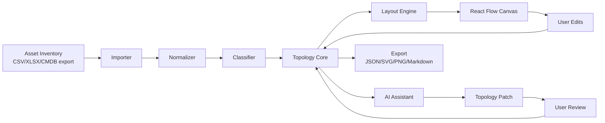

# Topology Workbench Restart Design

Date: 2026-05-14
Status: Approved direction for implementation planning

## Goal

Restart the project as an asset-inventory-driven cloud and business architecture topology workbench.

Excalidraw is not a required foundation. The product should use a structured topology model as the source of truth, render that model through a graph canvas, and use AI as an assistant for classification, cleanup, topology refinement, and post-generation natural-language edits.

## Product Positioning

The product is not a generic whiteboard. It is a tool for turning raw infrastructure and application asset data into understandable cloud/business architecture topology diagrams.

Primary users import an asset inventory, review cleanup and classification suggestions, generate an initial topology, then refine the result manually or through natural language.

The main diagram style is cloud and business system architecture:

- business domains, systems, applications, services
- cloud resources such as VPCs, subnets, load balancers, compute, Kubernetes, databases, cache, queues, object storage
- boundaries such as cloud account, region, availability zone, environment, IDC, DMZ, external partner
- network connectivity such as leased lines, VPN, cloud enterprise network, VPC peering, gateways, NAT, firewall, security boundary
- semantic relationships such as calls, depends on, data flow, deployed on, connects to, secured by

Network device topology is supported as a secondary use case, mainly when it explains cloud/business system connectivity such as local IDC interconnects, leased lines, VPNs, firewalls, routers, switches, and gateways.

## Non-Goals

- Preserve Excalidraw as the long-term rendering foundation.
- Preserve Excalidraw freehand drawing semantics as the core product model.
- Build a generic diagramming or whiteboard product.
- Make natural language the primary source for initial topology generation.
- Let AI directly mutate canvas-specific objects without a user-confirmed structured patch.

## Recommended Stack

Use React Flow (`@xyflow/react`) as the primary topology canvas.

Use ELK (`elkjs`) as the primary automatic layout engine because the target diagrams need layered architecture, containers, ports, and controlled edge routing.

Use Dagre (`@dagrejs/dagre`) as a simple and fast fallback layout for small dependency graphs.

Keep Cytoscape.js out of the first implementation. It can be introduced later for large-scale read-only graph analysis, dependency traversal, impact analysis, or graph metrics.

Use CSV import as the first asset inventory ingestion path. CSV can continue to use PapaParse. XLSX should be added after the MVP import contract is stable.

## Architecture

The product should be rebuilt around a domain model, not around canvas elements.



The topology core owns the canonical graph. The canvas renders the graph and emits user actions. AI produces proposed patches against the graph. Layout is deterministic and can be rerun after import, filtering, grouping, or patch application.

## Components

### Importer

Responsibilities:

- Accept CSV as the first supported raw inventory format.
- Preserve the original columns and row IDs.
- Detect headers and basic data types.
- Produce an import preview before any topology generation.

Inputs:

- CSV text or file.
- Optional user-selected encoding and delimiter when auto-detection fails.

Outputs:

- `RawAssetTable`
- parse warnings with row and column references

### Normalizer

Responsibilities:

- Normalize whitespace, hostnames, IP addresses, CIDR blocks, environment names, cloud provider names, regions, and resource IDs.
- Detect duplicate assets and likely aliases.
- Identify incomplete rows and conflicting fields.
- Keep original raw values for traceability.

Outputs:

- `NormalizedAsset[]`
- `DataQualityIssue[]`
- `NormalizationSummary`

### Classifier

Responsibilities:

- Apply deterministic rules first.
- Suggest resource type, layer, environment, ownership, network boundary, and business grouping.
- Ask AI only for ambiguous semantic classification such as business domain, application grouping, or unclear service purpose.
- Present classification confidence and reasons to the user.

Outputs:

- `ClassifiedAsset[]`
- `ClassificationSuggestion[]`
- `ClassificationIssue[]`

### Topology Core

Responsibilities:

- Convert classified assets into a structured topology graph.
- Validate node and edge references.
- Apply user and AI patches.
- Track provenance from topology nodes and edges back to original inventory rows.
- Support filtering by environment, business domain, resource type, and network boundary.

The core model is independent of React Flow, ELK, and AI providers.

### Layout Engine

Responsibilities:

- Convert `Topology` into layout input.
- Use layered layout for business/system/cloud/network diagrams.
- Preserve user-pinned positions.
- Route edges based on semantic edge type.
- Return positions and layout metadata without changing topology semantics.

### Topology Canvas

Responsibilities:

- Render topology nodes and edges through React Flow.
- Support selection, drag, zoom, minimap, fit view, connection editing, grouping, and property inspection.
- Keep visual changes separate from semantic topology changes.
- Emit domain-level edit commands instead of leaking React Flow object mutations into the core.

### AI Assistant

Responsibilities:

- Explain imported data quality issues.
- Suggest classification and grouping for ambiguous assets.
- Suggest topology improvements after graph generation.
- Convert natural-language user instructions into `TopologyPatch` proposals.
- Never apply a generated patch without user review.

Example user instructions:

- "把支付系统和订单系统拆成两个业务域"
- "把 Redis 放到缓存层"
- "补充本地 IDC 到阿里云 VPC 的专线"
- "隐藏测试环境资源"
- "把数据库相关风险标出来"

## Data Model

```ts
type RawAssetRow = {
  rowId: string;
  cells: Record<string, string>;
};

type RawAssetTable = {
  headers: string[];
  rows: RawAssetRow[];
  warnings: ImportWarning[];
};

type ImportWarning = {
  rowId?: string;
  column?: string;
  message: string;
};

type DataQualityIssue = {
  id: string;
  assetId?: string;
  rowId?: string;
  field?: string;
  severity: "error" | "warning" | "info";
  category:
    | "missing_required_field"
    | "invalid_ip_or_cidr"
    | "duplicate_asset"
    | "conflicting_value"
    | "unknown_resource_type";
  message: string;
};

type NormalizationSummary = {
  totalRows: number;
  assetCount: number;
  issueCount: number;
  duplicateCount: number;
};

type NormalizedAsset = {
  id: string;
  sourceRowIds: string[];
  raw: Record<string, string>;
  normalized: {
    name?: string;
    hostname?: string;
    privateIp?: string;
    publicIp?: string;
    cidr?: string;
    provider?: "aliyun" | "aws" | "azure" | "gcp" | "tencent" | "huawei" | "on_prem" | "unknown";
    region?: string;
    account?: string;
    environment?: "prod" | "staging" | "test" | "dev" | "unknown";
    owner?: string;
    application?: string;
    businessDomain?: string;
  };
  issues: DataQualityIssue[];
};

type ClassifiedAsset = NormalizedAsset & {
  classification: {
    nodeKind: TopologyNodeKind;
    resourceType?: string;
    layer?: "business" | "application" | "middleware" | "data" | "network" | "external";
    confidence: "low" | "medium" | "high";
    reason: string;
  };
};

type ClassificationSuggestion = {
  id: string;
  assetId: string;
  proposed: ClassifiedAsset["classification"];
  source: "rule" | "ai";
  requiresReview: boolean;
};

type ClassificationIssue = {
  id: string;
  assetId: string;
  message: string;
  blocking: boolean;
};

type TopologyNodeKind =
  | "business_domain"
  | "system"
  | "application"
  | "service"
  | "cloud_resource"
  | "network_resource"
  | "data_resource"
  | "external_system"
  | "boundary";

type TopologyEdgeKind =
  | "calls"
  | "depends_on"
  | "data_flow"
  | "deployed_on"
  | "network_connects"
  | "secured_by"
  | "contains";

type TopologyNode = {
  id: string;
  kind: TopologyNodeKind;
  label: string;
  tags: Record<string, string>;
  sourceAssetIds: string[];
  parentId?: string;
  pinnedPosition?: { x: number; y: number };
};

type TopologyEdge = {
  id: string;
  kind: TopologyEdgeKind;
  sourceId: string;
  targetId: string;
  label?: string;
  tags: Record<string, string>;
  sourceAssetIds: string[];
};

type Topology = {
  id: string;
  nodes: TopologyNode[];
  edges: TopologyEdge[];
  metadata: {
    name: string;
    generatedAt: number;
    importSource: "csv" | "xlsx" | "cmdb";
  };
};

type TopologyPatch = {
  operations: Array<
    | { type: "add_node"; node: TopologyNode }
    | { type: "update_node"; nodeId: string; patch: Partial<TopologyNode> }
    | { type: "remove_node"; nodeId: string }
    | { type: "add_edge"; edge: TopologyEdge }
    | { type: "update_edge"; edgeId: string; patch: Partial<TopologyEdge> }
    | { type: "remove_edge"; edgeId: string }
    | { type: "set_parent"; nodeId: string; parentId?: string }
  >;
  reason: string;
  confidence: "low" | "medium" | "high";
};
```

## Data Flow

1. User imports an asset inventory.
2. Importer creates raw rows and parse warnings.
3. Normalizer creates normalized assets and quality issues.
4. Classifier creates deterministic labels and AI-assisted suggestions.
5. User confirms mappings, cleanup decisions, and classification suggestions.
6. Topology core generates topology nodes, edges, boundaries, and provenance.
7. Layout engine computes positions.
8. React Flow renders the topology.
9. User edits directly or asks for a natural-language change.
10. AI assistant returns a `TopologyPatch`.
11. User reviews the patch diff.
12. Topology core validates and applies the patch.
13. Layout reruns only for affected unpinned areas.

## Error Handling

- Import parse errors must show row and column references when available.
- Normalization issues must be grouped by fix type: missing required field, invalid IP/CIDR, duplicate asset, conflicting owner/environment, unknown resource type.
- Classification suggestions with low confidence must be review-required.
- AI failures must not block manual cleanup or topology editing.
- Invalid AI patches must be rejected before they reach the graph.
- Patch validation must catch missing node references, duplicate IDs, invalid parent cycles, and edge kinds that do not match node kinds.
- Layout failures must preserve the existing topology and show a recoverable error with a fallback layout option.

## Testing Strategy

Unit tests:

- CSV parsing and header detection.
- normalization of hostnames, IP addresses, CIDR blocks, environments, providers, and regions.
- duplicate and alias detection.
- rule-based classification.
- topology generation from classified assets.
- topology patch validation and application.
- layout input/output conversion.

Integration tests:

- import sample CSV, clean data, classify assets, generate topology.
- apply a natural-language patch fixture and verify graph changes.
- reject invalid AI patch fixtures.
- preserve pinned node positions across layout reruns.

UI tests:

- import preview flow.
- cleanup issue review flow.
- classification confirmation flow.
- topology canvas renders nodes, edges, groups, and selected properties.
- patch review dialog displays proposed changes before application.

## Migration Strategy

Do not begin by refactoring the current Excalidraw fork.

Create a parallel proof of concept that validates the new product architecture:

1. Parse a representative CSV asset inventory.
2. Normalize and classify assets.
3. Generate `Topology`.
4. Render through React Flow.
5. Layout with ELK.
6. Apply a fixture `TopologyPatch`.
7. Export JSON and SVG/PNG.

After the proof of concept works, migrate useful existing logic selectively:

- CSV parsing heuristics from the current AI generation flow.
- AI settings and provider compatibility if still needed.
- prompt patterns that help classify business scope and service grouping.

The old Excalidraw-based flow should remain available only as a reference until the new topology workbench reaches parity for the selected MVP path.

## MVP Scope

The first working version should include:

- CSV import.
- field mapping and import preview.
- normalization report.
- rule-based classification with user confirmation.
- AI-assisted classification for ambiguous rows.
- topology generation.
- React Flow canvas rendering.
- ELK layout.
- node and edge property editing.
- natural-language topology adjustment through reviewed patches.
- JSON export.
- SVG or PNG export.

## Resolved Product Decisions

The following decisions are intentionally resolved for the first implementation:

- The primary source for initial topology generation is asset inventory import.
- Natural language is used after topology generation for adjustment and optimization.
- React Flow is the preferred canvas.
- ELK is the preferred layout engine.
- Excalidraw is not a required dependency for the new foundation.
- Network topology support is included when it explains cloud/business architecture connectivity.
