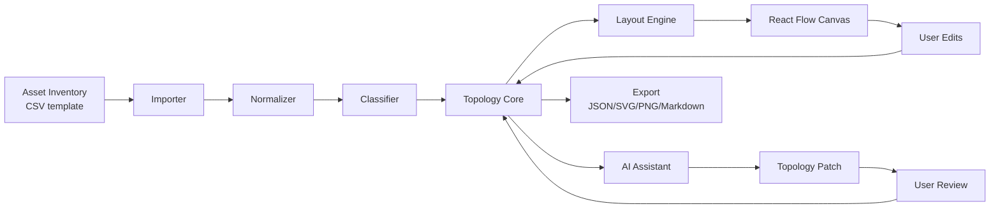

# Topology Workbench Restart Design

Date: 2026-05-14
Status: Approved direction with product and interaction constraints

## Goal

Restart the project as an asset-inventory-driven cloud and business architecture topology workbench.

Excalidraw is not a required foundation. The product should use a structured topology model as the source of truth, render that model through a graph canvas, and use AI as an assistant for classification, cleanup, topology refinement, and post-generation natural-language edits.

## Product Positioning

The product is not a generic whiteboard. It is a tool for turning raw infrastructure and application asset data into understandable cloud/business architecture topology diagrams.

Primary users import an asset inventory, review cleanup and classification suggestions, generate an initial topology, then refine the result manually or through natural language.

Primary user roles:

- Cloud architects who need layered cloud, application, and business-domain views.
- Operations and network owners who need connectivity, boundary, environment, and risk visibility.
- Application owners who need understandable upstream/downstream dependencies without reading raw asset tables.

The main diagram style is cloud and business system architecture:

- business domains, systems, applications, services
- cloud resources such as VPCs, subnets, load balancers, compute, Kubernetes, databases, cache, queues, object storage
- boundaries such as cloud account, region, availability zone, environment, IDC, DMZ, external partner
- network connectivity such as leased lines, VPN, cloud enterprise network, VPC peering, gateways, NAT, firewall, security boundary
- semantic relationships such as calls, depends on, data flow, deployed on, connects to, secured by

Network device topology is supported as a secondary use case, mainly when it explains cloud/business system connectivity such as local IDC interconnects, leased lines, VPNs, firewalls, routers, switches, and gateways.

The core product promise is: import imperfect asset data, get a useful first topology quickly, then improve it through focused review and safe edits.

## Non-Goals

- Preserve Excalidraw as the long-term rendering foundation.
- Preserve Excalidraw freehand drawing semantics as the core product model.
- Build a generic diagramming or whiteboard product.
- Make natural language the primary source for initial topology generation.
- Let AI directly mutate canvas-specific objects without a user-confirmed structured patch.

## Recommended Stack

Use React Flow (`@xyflow/react`) as the primary topology canvas.

Use ELK (`elkjs`) as the primary automatic layout engine because the target diagrams need layered architecture, containers, ports, and controlled edge routing.

Use Dagre (`@dagrejs/dagre`) as a simple and fast fallback layout for small dependency graphs.

Keep Cytoscape.js out of the first implementation. It can be introduced later for large-scale read-only graph analysis, dependency traversal, impact analysis, or graph metrics.

Use CSV import as the first asset inventory ingestion path. CSV can continue to use PapaParse. XLSX should be added after the MVP import contract is stable.

## Product Success Metrics

- Time to first topology: a user can import a valid CSV template and see the first graph within one minute.
- Auto-classification acceptance rate: high-confidence rule classifications should be accepted without manual correction in most rows.
- Manual correction count: the product should minimize row-by-row cleanup and prefer batch review.
- Patch acceptance rate: accepted AI-generated topology patches should outnumber rejected patches after users provide clear instructions.
- Layout satisfaction: users should need minimal manual dragging after first layout and after patch application.
- Import recoverability: non-blocking data issues should not prevent generation of a partial topology.

## Architecture

The product should be rebuilt around a domain model, not around canvas elements.



The topology core owns the canonical graph. The canvas renders the graph and emits user actions. AI produces proposed patches against the graph. Layout is deterministic and can be rerun after import, filtering, grouping, or patch application.

## Components

### Importer

Responsibilities:

- Accept CSV as the first supported raw inventory format.
- Preserve the original columns and row IDs.
- Detect headers and basic data types.
- Auto-map known column aliases to the import contract.
- Score import readiness before topology generation.
- Produce an import preview before any topology generation.

Inputs:

- CSV text or file.
- Optional user-selected encoding and delimiter when auto-detection fails.

Outputs:

- `RawAssetTable`
- parse warnings with row and column references

### Import Contract

CSV is the first productized ingestion path. The first implementation should support a documented template and a tolerant mapper for common column aliases.

Required fields:

- `asset_id` or one stable identity field such as `resource_id`, `instance_id`, `hostname`, or `name`.
- `name` or `hostname`.
- `resource_type`, `service_type`, or enough provider-specific metadata to infer type.

Recommended fields:

- `provider`, `account`, `region`, `zone`
- `environment`
- `private_ip`, `public_ip`, `cidr`
- `application`, `system`, `business_domain`, `owner`
- `vpc`, `subnet`, `security_group`, `gateway`, `load_balancer`
- `depends_on`, `connects_to`, `calls`, or equivalent relationship columns

Optional fields:

- `risk`, `criticality`, `tags`, `cost_center`, `description`
- network details such as `vpn`, `leased_line`, `firewall`, `router`, `switch`

Example CSV:

```csv
instance_id,name,service_type,environment,business_domain,application,system,private_ip,public_ip,cidr,depends_on,connects_to,calls,tags
svc-checkout,Checkout API,service,prod,Commerce,Checkout,Order,10.0.1.10,,,rds-orders,vpc-core,worker-settlement,team=payments;tier=api
rds-orders,Orders Database,RDS,prod,Commerce,Checkout,Order,10.0.2.20,,,,,,risk=pii;tier=data
vpc-core,Core VPC,VPC,prod,Shared,Network,Core,,,10.0.0.0/16,,vpn-idc,,owner=network
vpn-idc,IDC Direct Connect,leased_line,prod,Shared,Network,WAN,,,172.16.0.0/16,,,,provider=carrier
```

Import readiness rules:

- High readiness: required identity, label, type, and environment can be resolved for most rows.
- Medium readiness: topology can be generated, but the user should review missing groupings or ambiguous resource types.
- Low readiness: the user should fix mappings before generation unless they explicitly choose partial generation.

### Normalizer

Responsibilities:

- Normalize whitespace, hostnames, IP addresses, CIDR blocks, environment names, cloud provider names, regions, and resource IDs.
- Detect duplicate assets and likely aliases.
- Identify incomplete rows and conflicting fields.
- Keep original raw values for traceability.

Outputs:

- `NormalizedAsset[]`
- `DataQualityIssue[]`
- `NormalizationSummary`

### Classifier

Responsibilities:

- Apply deterministic rules first.
- Suggest resource type, layer, environment, ownership, network boundary, and business grouping.
- Ask AI only for ambiguous semantic classification such as business domain, application grouping, or unclear service purpose.
- Present classification confidence and reasons to the user.
- Use confidence tiers to reduce user workload: high-confidence suggestions auto-accept, medium-confidence suggestions support batch confirmation, and low-confidence suggestions require focused review.

Outputs:

- `ClassifiedAsset[]`
- `ClassificationSuggestion[]`
- `ClassificationIssue[]`

### Topology Core

Responsibilities:

- Convert classified assets into a structured topology graph.
- Validate node and edge references.
- Apply user and AI patches.
- Track provenance from topology nodes and edges back to original inventory rows.
- Support filtering by environment, business domain, resource type, and network boundary.

The core model is independent of React Flow, ELK, and AI providers.

### Layout Engine

Responsibilities:

- Convert `Topology` into layout input.
- Use layered layout for business/system/cloud/network diagrams.
- Preserve user-pinned positions.
- Route edges based on semantic edge type.
- Return positions and layout metadata without changing topology semantics.

### Topology Canvas

Responsibilities:

- Render topology nodes and edges through React Flow.
- Support selection, drag, zoom, minimap, fit view, connection editing, grouping, and property inspection.
- Support topology-specific navigation: asset search, environment/domain/resource filters, upstream/downstream focus, boundary expand/collapse, source-row inspection, local relayout, and pinned node management.
- Keep visual changes separate from semantic topology changes.
- Emit domain-level edit commands instead of leaking React Flow object mutations into the core.

### AI Assistant

Responsibilities:

- Explain imported data quality issues.
- Suggest classification and grouping for ambiguous assets.
- Suggest topology improvements after graph generation.
- Convert natural-language user instructions into `TopologyPatch` proposals.
- Never apply a generated patch without user review.
- Present patch impact in product language before application: affected nodes, affected edges, added boundaries, removed relationships, and any validation risks.

Example user instructions:

- "把支付系统和订单系统拆成两个业务域"
- "把 Redis 放到缓存层"
- "补充本地 IDC 到阿里云 VPC 的专线"
- "隐藏测试环境资源"
- "把数据库相关风险标出来"

### Patch Review

The patch review UI is a core safety surface, not a generic confirmation dialog.

Responsibilities:

- Show a plain-language summary of the requested change and AI interpretation.
- List each operation in the patch with affected topology objects.
- Highlight affected nodes and edges on the canvas before application.
- Allow users to accept the full patch, reject it, or disable individual operations when validation still passes.
- Validate the resulting patch after any user changes.
- Preserve a rollback entry after application.
- Explain rejected operations with concrete reasons such as missing node, duplicate ID, invalid parent cycle, or unsupported edge kind.

The review should prefer topology terms over implementation terms. For example, show "Move Redis to cache layer" instead of `update_node`.

## Product Interaction Model

The default user journey should optimize for fast first value and avoid row-by-row review unless the data requires it.

1. Import CSV.
2. Preview mapped fields and import readiness.
3. Fix only blocking mapping issues.
4. Generate a first topology with high-confidence classifications auto-applied.
5. Review medium-confidence classifications in batches.
6. Resolve low-confidence or blocking issues through a focused queue.
7. Explore the topology with search, filters, focus mode, and boundary expand/collapse.
8. Edit properties or relationships directly when the intent is precise.
9. Use natural language when the intent spans multiple nodes or needs semantic regrouping.
10. Review and apply a structured patch.

Review workload rules:

- Do not require users to approve every deterministic classification.
- Do not block topology generation on issues that can be represented as warnings.
- Prefer batch actions such as "accept all high-confidence VPC/subnet mappings" over individual row approval.
- Keep original source rows visible for traceability whenever the user inspects a node, edge, or issue.

## Data Model

```ts
type RawAssetRow = {
  rowId: string;
  cells: Record<string, string>;
};

type RawAssetTable = {
  headers: string[];
  rows: RawAssetRow[];
  warnings: ImportWarning[];
};

type ImportWarning = {
  rowId?: string;
  column?: string;
  message: string;
};

type DataQualityIssue = {
  id: string;
  assetId?: string;
  rowId?: string;
  field?: string;
  severity: "error" | "warning" | "info";
  category:
    | "missing_required_field"
    | "invalid_ip_or_cidr"
    | "duplicate_asset"
    | "conflicting_value"
    | "unknown_resource_type";
  message: string;
};

type NormalizationSummary = {
  totalRows: number;
  assetCount: number;
  issueCount: number;
  duplicateCount: number;
};

type NormalizedAsset = {
  id: string;
  sourceRowIds: string[];
  raw: Record<string, string>;
  normalized: {
    name?: string;
    hostname?: string;
    privateIp?: string;
    publicIp?: string;
    cidr?: string;
    provider?: "aliyun" | "aws" | "azure" | "gcp" | "tencent" | "huawei" | "on_prem" | "unknown";
    region?: string;
    account?: string;
    environment?: "prod" | "staging" | "test" | "dev" | "unknown";
    owner?: string;
    application?: string;
    businessDomain?: string;
  };
  issues: DataQualityIssue[];
};

type ClassifiedAsset = NormalizedAsset & {
  classification: {
    nodeKind: TopologyNodeKind;
    resourceType?: string;
    layer?: "business" | "application" | "middleware" | "data" | "network" | "external";
    confidence: "low" | "medium" | "high";
    reason: string;
  };
};

type ClassificationSuggestion = {
  id: string;
  assetId: string;
  proposed: ClassifiedAsset["classification"];
  source: "rule" | "ai";
  requiresReview: boolean;
};

type ClassificationIssue = {
  id: string;
  assetId: string;
  message: string;
  blocking: boolean;
};

type TopologyNodeKind =
  | "business_domain"
  | "system"
  | "application"
  | "service"
  | "cloud_resource"
  | "network_resource"
  | "data_resource"
  | "external_system"
  | "boundary";

type TopologyEdgeKind =
  | "calls"
  | "depends_on"
  | "data_flow"
  | "deployed_on"
  | "network_connects"
  | "secured_by"
  | "contains";

type TopologyNode = {
  id: string;
  kind: TopologyNodeKind;
  label: string;
  tags: Record<string, string>;
  sourceAssetIds: string[];
  parentId?: string;
  pinnedPosition?: { x: number; y: number };
};

type TopologyEdge = {
  id: string;
  kind: TopologyEdgeKind;
  sourceId: string;
  targetId: string;
  label?: string;
  tags: Record<string, string>;
  sourceAssetIds: string[];
};

type Topology = {
  id: string;
  nodes: TopologyNode[];
  edges: TopologyEdge[];
  metadata: {
    name: string;
    generatedAt: number;
    importSource: "csv" | "xlsx" | "cmdb";
  };
};

type TopologyPatch = {
  operations: Array<
    | { type: "add_node"; node: TopologyNode }
    | { type: "update_node"; nodeId: string; patch: Partial<TopologyNode> }
    | { type: "remove_node"; nodeId: string }
    | { type: "add_edge"; edge: TopologyEdge }
    | { type: "update_edge"; edgeId: string; patch: Partial<TopologyEdge> }
    | { type: "remove_edge"; edgeId: string }
    | { type: "set_parent"; nodeId: string; parentId?: string }
  >;
  reason: string;
  confidence: "low" | "medium" | "high";
};
```

## Data Flow

1. User imports an asset inventory.
2. Importer creates raw rows and parse warnings.
3. User confirms or fixes blocking field mappings.
4. Normalizer creates normalized assets and quality issues.
5. Classifier creates deterministic labels and AI-assisted suggestions.
6. High-confidence suggestions auto-apply; medium-confidence suggestions are queued for batch review; low-confidence suggestions require focused review.
7. Topology core generates topology nodes, edges, boundaries, and provenance.
8. Layout engine computes positions.
9. React Flow renders the topology.
10. User explores, filters, edits directly, or asks for a natural-language change.
11. AI assistant returns a `TopologyPatch`.
12. User reviews the patch summary, operation list, and canvas highlights.
13. Topology core validates and applies the accepted patch.
14. Layout reruns only for affected unpinned areas.

## Error Handling

- Import parse errors must show row and column references when available.
- Blocking field-mapping errors must prevent generation until fixed or explicitly skipped.
- Non-blocking import and normalization issues must still allow partial topology generation.
- Normalization issues must be grouped by fix type: missing required field, invalid IP/CIDR, duplicate asset, conflicting owner/environment, unknown resource type.
- Classification suggestions with low confidence must be review-required.
- AI failures must not block manual cleanup or topology editing.
- Invalid AI patches must be rejected before they reach the graph.
- Patch validation must catch missing node references, duplicate IDs, invalid parent cycles, and edge kinds that do not match node kinds.
- Layout failures must preserve the existing topology and show a recoverable error with a fallback layout option.

## Testing Strategy

Unit tests:

- CSV parsing and header detection.
- import contract mapping and readiness scoring.
- normalization of hostnames, IP addresses, CIDR blocks, environments, providers, and regions.
- duplicate and alias detection.
- rule-based classification.
- classification confidence tiering.
- topology generation from classified assets.
- topology patch validation and application.
- layout input/output conversion.

Integration tests:

- import sample CSV, clean data, classify assets, generate topology.
- apply a natural-language patch fixture and verify graph changes.
- reject invalid AI patch fixtures.
- preserve pinned node positions across layout reruns.

UI tests:

- import preview flow.
- blocking mapping repair flow.
- cleanup issue review flow.
- batch classification confirmation flow.
- topology canvas renders nodes, edges, groups, and selected properties.
- topology search, filters, focus mode, and boundary expand/collapse.
- patch review dialog displays proposed changes before application.

## Migration Strategy

Do not begin by refactoring the current Excalidraw fork.

Create a parallel proof of concept in phased slices that validate the new product architecture without expanding the first deliverable. The proof of concept uses CSV only; XLSX and CMDB imports remain later product extensions.

Current implementation note: the P3 slice includes `.xlsx` import using the same import contract after the CSV pipeline stabilized; legacy `.xls` is intentionally not advertised.

P0 proof of concept:

1. Parse a representative CSV asset inventory.
2. Normalize and classify assets with deterministic rules.
3. Generate `Topology`.
4. Render through React Flow.
5. Layout with ELK.
6. Support basic search and filters.
7. Export JSON.

P1/P2/P3 proof extensions:

- Apply a fixture `TopologyPatch`.
- Validate patch review, operation toggling, validation, and rollback.
- Export SVG/PNG after the JSON export and canvas rendering paths are stable.

After the proof of concept works, migrate useful existing logic selectively:

- CSV parsing heuristics from the current AI generation flow.
- AI settings and provider compatibility if still needed.
- prompt patterns that help classify business scope and service grouping.

The old Excalidraw-based flow should remain available only as a reference until the new topology workbench reaches parity for the selected MVP path.

## MVP Phasing

The first implementation should be phased so the product reaches value quickly before adding AI-heavy and export-heavy workflows.

P0: First usable topology

- Documented CSV template and import contract.
- CSV import with preview and basic field auto-mapping.
- Blocking mapping repair for identity, label, and type fields.
- Rule-based normalization and classification.
- Topology generation from classified assets.
- React Flow rendering with ELK layout.
- Search, environment filter, business-domain filter, and resource-type filter.
- Node and edge property inspection.
- JSON export.

P1: Review and cleanup efficiency

- Import readiness score.
- Normalization report.
- Batch confirmation for medium-confidence classifications.
- Focused queue for low-confidence or blocking classification issues.
- Source-row traceability from nodes, edges, and issues.
- Pinned positions and local relayout.

P2: AI-assisted refinement

- AI-assisted classification for ambiguous rows.
- Natural-language topology adjustment through reviewed `TopologyPatch` proposals.
- Patch review with canvas highlights, per-operation disablement, validation, and rollback.
- Risk annotation prompts such as marking database-related risks.

P3: Export and advanced topology work

- SVG or PNG export.
- XLSX import after CSV contract stability.
- Advanced network connectivity views when needed for cloud/business topology.
- Large-graph read-only analysis if Cytoscape.js becomes justified.

## Resolved Product Decisions

The following decisions are intentionally resolved for the first implementation:

- The primary source for initial topology generation is asset inventory import.
- Natural language is used after topology generation for adjustment and optimization.
- React Flow is the preferred canvas.
- ELK is the preferred layout engine.
- Excalidraw is not a required dependency for the new foundation.
- Network topology support is included when it explains cloud/business architecture connectivity.
- The MVP should be phased; AI patching and image export are not required for the first usable topology.
